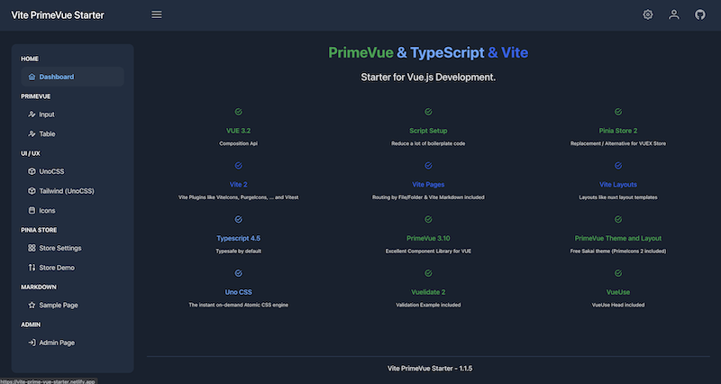

# Vite Typescript + PrimeVue Starter

Build your VUE.js App with the latest and fastest VITE Plugins (nuxt.js like).
First Class PrimeVUE support.



[](https://github.com/sfxcode/vite-primevue-starter/actions/workflows/main.yml)

THX to [antfu / Vitesse](https://github.com/antfu/vitesse) for starter code

## Features
 
- Vue 3.2 (with script setup)
- Routing VitePages / ViteLayout
- Pina as Store
- PrimeVue with Theme: Sakai (Free Admin Template)
- Markdown Support (VitePages)
- TypeScript 4.4
- Tailwind support
- SSG Support
- Eslint
- Prettier
- Testing with cypress (e2e, component)

### Modules
- i18n
- logging
- nprogress
- pinia
- primevue

### PrimeFlex
If you want to use PrimeFlex + Tailwind, you have to use a tailwind prefix because of style class name clashing.

## Project setup and usage

Install pnpm:
[https://pnpm.io/installation](https://pnpm.io/installation)

Install dependencies:

```
pnpm install
```

Run development server:

```
pnpm dev
```

Open Cypress test runner:

```
pnpm test:e2e
```

Component test runner:

```
pnpm test:unit
```

Run Cypress tests in headless mode:

```
pnpm test:ci
```

Build and preview built site locally:

```
pnpm preview
```

Build:

```
pnpm build
```

## Tools

I use IntelliJ with VUE.js, Tailwind and Prettier plugin.

## Supporters

JetBrains is supporting this open source project with:

[](http://www.jetbrains.com/idea/)

##Primeview
https://www.primefaces.org/primevue/showcase-v2/#/datatable/crud


Rozwiązanie problemu:
is declared but its value is never read.Vetur(6133)
https://github.com/vuejs/vetur/issues/3115


Lifecycle Hooks
https://v3.vuejs.org/guide/composition-api-lifecycle-hooks.html

Script setup
https://github.com/vuejs/rfcs/blob/master/active-rfcs/0040-script-setup.md
https://learnvue.co/2021/05/explaining-the-new-script-setup-type-in-vue-3-major-takeaways-from-the-rfc/


children <-> parent 
https://stackoverflow.com/questions/64407883/vue-3-access-child-component-from-slots